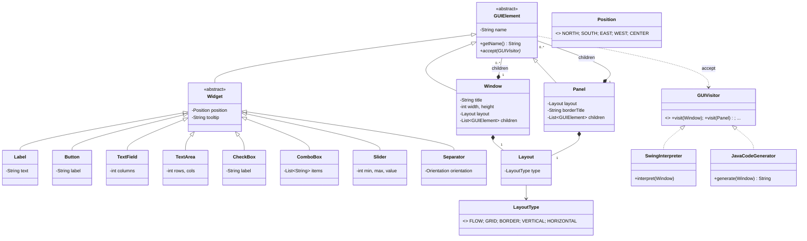
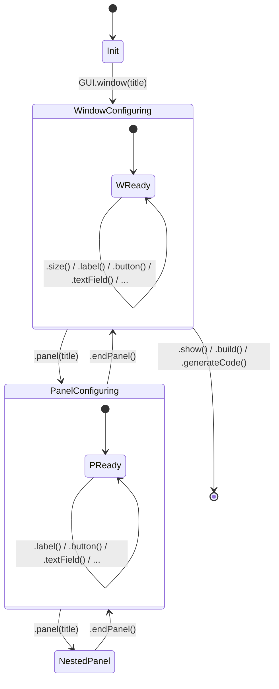

# QuickGUI — Week 2: (Meta)modeling

## 1. Representative Examples

We define 3 representative examples that cover the breadth of the GUI domain.
By analyzing what is **common** and what **differs** across them, we derive the
metamodel.

---

### Example 1: Login Form

A data-entry form with labeled fields and action buttons.

```
┌──────────────── Login ─────────────────┐
│ "Please sign in"                       │
│ ┌─── Form ─────────────────┐           │
│ │ Username:                │           │
│ │ [______________]         │           │
│ │ Password:                │           │
│ │ [______________]         │           │
│ │ ☑ Remember me            │           │
│ └──────────────────────────┘           │
│ [Login]                                │
│ [Cancel]                               │
└────────────────────────────────────────┘
```

**DSL program:**
```java
GUI.window("Login")
   .size(350, 250)
   .label("Please sign in")
   .panel("Form")
       .label("Username:")
       .textField("username")
       .label("Password:")
       .textField("password")
       .checkBox("Remember me")
   .endPanel()
   .button("Login")
   .button("Cancel")
   .show();
```

**Elements used:** Window, Panel (×1), Label (×3), TextField (×2), CheckBox, Button (×2)
**Features:** Titled panel for visual grouping, nested structure

---

### Example 2: Text Editor

An application with toolbar, central editing area, and status bar.

```
┌──────────── QuickEdit ─────────────────┐
│ ┌── Toolbar ─────────────────────┐     │
│ │ [New] [Open] [Save] ─ [Font▼]  │     │
│ └────────────────────────────────┘     │
│ (multi-line scrollable text area)      │
│ ┌── Status ──────────────────────┐     │
│ │ Ready             Ln 1, Col 1  │     │
│ └────────────────────────────────┘     │
└────────────────────────────────────────┘
```

**DSL program:**
```java
GUI.window("QuickEdit")
   .size(600, 400)
   .panel("Toolbar")
       .button("New")
       .button("Open")
       .button("Save")
       .comboBox("font", "Calibri", "Arial", "Times New Roman")
   .endPanel()
   .textArea("editor", 20, 60)
   .panel("Status")
       .label("Ready")
       .label("Ln 1, Col 1")
   .endPanel()
   .show();
```

**Elements used:** Window, Panel (×2), Button (×3), Separator, ComboBox, TextArea, Label (×2)
**Features:** Diverse widget types, separator as visual divider, scrollable text area

---

### Example 3: Settings Form

A configuration dialog with grouped sections.

```
┌─────────────── Settings ──────────────────┐
│ ┌─ Appearance ─────────────────┐          │
│ │ Theme:     [Light       ▼]  │          │
│ │ Font Size: ═══════●═══════  │          │
│ │ ☑ Show line numbers         │          │
│ │ ☐ Word wrap                 │          │
│ └──────────────────────────────┘          │
│ ┌─ Network ────────────────────┐          │
│ │ Proxy Host:                  │          │
│ │ [localhost_____]             │          │
│ │ Proxy Port:                  │          │
│ │ [8080__]                     │          │
│ └──────────────────────────────┘          │
└───────────────────────────────────────────┘
```

**DSL program:**
```java
GUI.window("Settings")
   .size(400, 350)
   .panel("Appearance")
       .label("Theme:")
       .comboBox("theme", "Light", "Dark", "System Default")
       .label("Font Size:")
       .slider("fontSize", 8, 32, 14)
       .checkBox("Show grid")
   .endPanel()
   .panel("Profile settings")
       .label("Change username:")
       .textField("proxyHost", 20)
       .label("Change Password:")
       .textField("proxyPort", 6)
   .endPanel()
   .show();
```

**Elements used:** Window, Panel (×2), Label (×4), ComboBox (×1), Slider, CheckBox (×2), TextField (×2)
**Features:** Titled border panels for grouping, all parameter types are strings or numbers

---

## 2. Abstracting Common Properties

By comparing the 3 examples, we identify patterns:

### What is common across ALL examples

| Property           | Login Form | Text Editor | Settings | → Abstraction          |
|--------------------|:----------:|:-----------:|:--------:|------------------------|
| Top-level window   | ✓          | ✓           | ✓        | **Window** (always 1)  |
| Has a title        | ✓          | ✓           | ✓        | Window.title           |
| Has a size         | ✓          | ✓           | ✓        | Window.width/height    |
| Has a layout       | ✓          | ✓           | ✓        | Window.layout (auto)   |
| Contains children  | ✓          | ✓           | ✓        | Window.children (list) |
| Uses panels        | ✓          | ✓           | ✓        | **Panel** (container)  |
| Panels have layout | ✓          | ✓           | ✓        | Panel.layout (auto)    |
| Uses labels        | ✓          | ✓           | ✓        | **Label** (widget)     |
| Every element has a name | ✓    | ✓           | ✓        | GUIElement.name        |

### What VARIES across examples

| Variation               | Login | Editor | Settings | → Abstraction           |
|-------------------------|:-----:|:------:|:--------:|-------------------------|
| Uses buttons            | ✓     | ✓      |          | **Button** (optional)   |
| Uses text fields        | ✓     |        | ✓        | **TextField** (optional)|
| Uses text area          |       | ✓      |          | **TextArea** (optional) |
| Uses checkboxes         | ✓     |        | ✓        | **CheckBox** (optional) |
| Uses combo box          |       | ✓      | ✓        | **ComboBox** (optional) |
| Uses slider             |       | ✓      | ✓        | **Slider** (optional)   |
| Uses separator          |       | ✓      |          | **Separator** (optional)|
| Titled border on panels |       | ✓      | ✓        | Panel.borderTitle (auto)|
| Default text in fields  |       |        | ✓        | TextField.defaultText   |

### Abstraction Hierarchy Derived

From the analysis above, we identify:
- **Two kinds of elements**: *containers* (can hold children) vs *widgets* (leaf elements)
- **Common container traits**: both Window and Panel have a layout (automatic) and a list of children
- **Common widget traits**: all widgets have a name
- **Each widget type** adds its own specific properties (text, label, items, range, etc.)
- The DSL user works only with **strings and numbers** — layout, position, and other technical
  aspects are handled automatically by the framework

This gives us the inheritance hierarchy:

```
GUIElement (name)
├── Window (title, width, height, layout, children)    ← container
├── Panel (layout, borderTitle, position, children)    ← container
└── Widget (position, tooltip)                         ← abstract leaf
    ├── Label (text)
    ├── Button (label, action)
    ├── TextField (columns, defaultText)
    ├── TextArea (rows, cols, defaultText, scrollable)
    ├── CheckBox (label, selected)
    ├── ComboBox (items, selectedIndex)
    ├── Slider (min, max, value, showTicks, majorTickSpacing)
    └── Separator (orientation)
```

Supporting types (internal — not exposed in the DSL):
- **Layout** (type, rows, cols, hgap, vgap) — automatic layout config, defaults to VERTICAL
- **LayoutType** enum: FLOW | GRID | BORDER | VERTICAL | HORIZONTAL
- **Position** enum: NORTH | SOUTH | EAST | WEST | CENTER
- **Orientation** enum: HORIZONTAL | VERTICAL

---

## 3. Meta-model (Class Diagram & State Machine Diagram)

> **See also:** [`MODELING.md`](MODELING.md) for the full UML class diagram and
> state machine diagram rendered as Mermaid diagrams.

The metamodel is expressed as a UML class diagram. The key design decisions:

1. **GUIElement** is the abstract root — every node has a `name` and supports the Visitor pattern
2. **Containers** (Window, Panel) hold an ordered list of `GUIElement` children (→ Composite pattern)
3. **Widget** is the abstract base for all leaf elements (non-containers)
4. **Layout** is a separate internal class (not exposed in the DSL) because layouts are *configurations* handled automatically
5. **GUIVisitor** enables open extension — new semantics (interpreter, code generator) without modifying the model

### Relationships

| Relationship              | Type          | Multiplicity | Meaning                                  |
|---------------------------|---------------|:------------:|------------------------------------------|
| GUIElement → Window       | Inheritance   | —            | Window IS-A GUIElement                   |
| GUIElement → Panel        | Inheritance   | —            | Panel IS-A GUIElement                    |
| GUIElement → Widget       | Inheritance   | —            | Widget IS-A GUIElement                   |
| Widget → Label, Button…   | Inheritance   | —            | Concrete widget types                    |
| Window → GUIElement       | Composition   | 1 to 0..*    | Window CONTAINS children                 |
| Panel → GUIElement        | Composition   | 1 to 0..*    | Panel CONTAINS children                  |
| Window → Layout           | Composition   | 1 to 1       | Window HAS a layout                      |
| Panel → Layout            | Composition   | 1 to 1       | Panel HAS a layout                       |
| Layout → LayoutType       | Association   | 1 to 1       | Layout uses a type enum                  |
| Widget → Position         | Association   | 0..1 to 0..1 | Optional positional constraint           |
| GUIElement → GUIVisitor   | Dependency    | —            | Elements ACCEPT visitor                  |
| SwingInterpreter          | Realization   | —            | IMPLEMENTS GUIVisitor                    |
| JavaCodeGenerator         | Realization   | —            | IMPLEMENTS GUIVisitor                    |

### UML Class Diagram (Mermaid)



### UML State Machine Diagram (DSL Builder Lifecycle)



### Design Patterns in the Meta-model

| Pattern       | Classes Involved                    | Role                                        |
|---------------|-------------------------------------|---------------------------------------------|
| **Composite** | GUIElement, Window, Panel, Widget   | Tree structure: containers hold children    |
| **Visitor**   | GUIVisitor, all GUIElement subtypes | Separate traversal from model structure     |
| **Builder**   | WindowBuilder, PanelBuilder         | Fluent construction of model objects (DSL)  |
| **CRTP**      | ContainerBuilder\<SELF\>            | Type-safe fluent return in inheritance      |

---

## 4. DSL Syntax Design

The internal DSL syntax is designed so that a Java method chain reads like a
**declarative GUI specification**. The syntax is enforced by the Java type
system (the compiler rejects invalid programs).

### Syntax Summary

The DSL exposes **only strings and numbers** as parameters.
Layout and positioning are handled automatically by the framework.

```
GUI.window(<title>)                     → WindowBuilder
   .size(<width>, <height>)             → WindowBuilder
   .label(<text>)                       → WindowBuilder
   .button(<text>)                      → WindowBuilder
   .textField(<name> [, <cols>])        → WindowBuilder
   .textArea(<name> [, <rows>, <cols>]) → WindowBuilder
   .checkBox(<text>)                    → WindowBuilder
   .comboBox(<name>, <items...>)        → WindowBuilder
   .slider(<name>, <min>, <max>, <val>) → WindowBuilder
   .separator()                         → WindowBuilder

   .panel(<title>)                      → PanelBuilder
       .label(...)                      → PanelBuilder
       ...                              → PanelBuilder
       .panel(...)                      → PanelBuilder (nested)
           ...
       .endPanel()                      → PanelBuilder (parent)
   .endPanel()                          → WindowBuilder

   .show()                              → Window (+ live GUI)
   .build()                             → Window (model only)
   .generateCode(<className>)           → String (Java source)
```

### BNF Grammar (Abstract Syntax)

```bnf
<gui-program>    ::= "GUI.window(" <string> ")" <window-config>* <terminal>
<window-config>  ::= <size> | <child> | <panel>
<size>           ::= ".size(" <int> "," <int> ")"
<child>          ::= <label> | <button> | <textfield> | <textarea>
                   | <checkbox> | <combobox> | <slider> | <separator>
<label>          ::= ".label(" <string> ")"
<button>         ::= ".button(" <string> ")"
<textfield>      ::= ".textField(" <string> ")"
                   | ".textField(" <string> "," <int> ")"
<textarea>       ::= ".textArea(" <string> ")"
                   | ".textArea(" <string> "," <int> "," <int> ")"
<checkbox>       ::= ".checkBox(" <string> ")"
<combobox>       ::= ".comboBox(" <string> "," <string>+ ")"
<slider>         ::= ".slider(" <string> "," <int> "," <int> "," <int> ")"
<separator>      ::= ".separator()"
<panel>          ::= ".panel(" <string> ")" <panel-config>* ".endPanel()"
<panel-config>   ::= <child> | <panel>
<terminal>       ::= ".show()" | ".build()" | ".generateCode(" <string> ")"
<string>         ::= (* any text in quotes *)
<int>            ::= (* any whole number *)
```

### Key DSL Design Decisions

1. **Entry point**: `GUI.window(title)` — single static method, clearly starts a new GUI
2. **Strings and numbers only**: every method takes only `String` and `int` parameters — no Java-specific types, no lambdas, no enums
3. **Automatic layout**: the framework assigns layouts internally (vertical stacking) — the user never needs to think about layout managers
4. **Scoped nesting**: `.panel("title") ... .endPanel()` creates visual indentation that mirrors the GUI hierarchy; panels auto-titled
5. **Type-safe returns**: `PanelBuilder.endPanel()` returns the parent type (Window or Panel builder) — the Java compiler prevents calling `.show()` inside a panel scope
6. **Terminal operations**: `.show()`, `.build()`, `.generateCode()` finalize the model — no more configuration possible after them

---

## 5. Meta-model to Implementation Mapping

| Meta-model Concept | Java Class(es)                 | Package              |
|--------------------|--------------------------------|----------------------|
| GUIElement         | `GUIElement.java`              | `quickgui.model`     |
| Window             | `Window.java`                  | `quickgui.model`     |
| Panel              | `Panel.java`                   | `quickgui.model`     |
| Widget (abstract)  | `Widget.java`                  | `quickgui.model`     |
| Concrete widgets   | `Label`, `Button`, `TextField`, `TextArea`, `CheckBox`, `ComboBox`, `Slider`, `Separator` | `quickgui.model` |
| Layout             | `Layout.java`                  | `quickgui.model`     |
| LayoutType         | `LayoutType.java` (enum)       | `quickgui.model`     |
| Position           | `Position.java` (enum)         | `quickgui.model`     |
| Visitor interface  | `GUIVisitor.java`              | `quickgui.model`     |
| DSL entry point    | `GUI.java`                     | `quickgui.dsl`       |
| Window builder     | `WindowBuilder.java`           | `quickgui.dsl`       |
| Panel builder      | `PanelBuilder.java`            | `quickgui.dsl`       |
| Shared builder API | `ContainerBuilder.java`        | `quickgui.dsl`       |
| Interpreter        | `SwingInterpreter.java`        | `quickgui.interpreter` |
| Code generator     | `JavaCodeGenerator.java`       | `quickgui.codegen`   |
