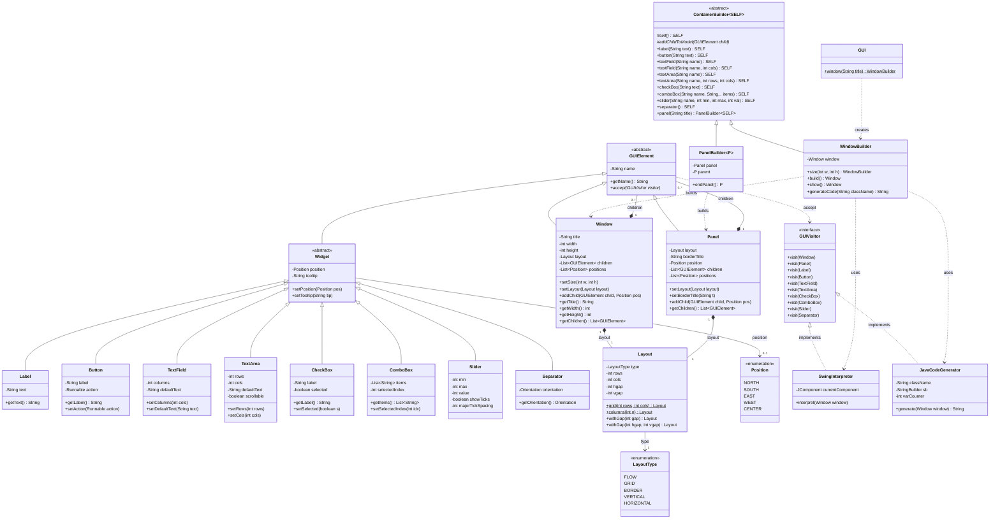
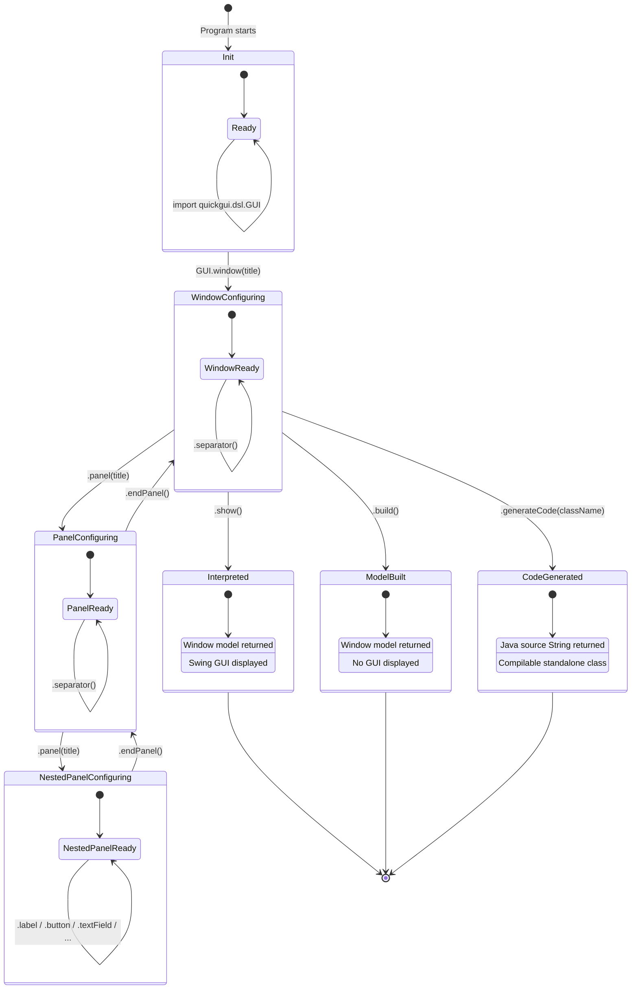

# QuickGUI — Modeling: Class Diagram & State Machine Diagram

This document provides **formal UML modeling** for the QuickGUI internal DSL,
covering the **class diagram** (metamodel structure) and the **state machine diagram**
(DSL builder lifecycle). These diagrams formalize the model implementation and
complement the metamodeling analysis in `METAMODELING.md`.

---

## 1. Class Diagram (Metamodel)

The class diagram captures the full structure of the QuickGUI metamodel, the DSL
builder layer, the visitor-based semantics layer, and all relationships between them.

### 1.1 Metamodel Layer (Domain Model)

The metamodel defines the **abstract syntax** of the GUI domain:

- **GUIElement** — abstract root; every node has a `name` and supports the Visitor pattern
- **Window** — top-level container with title, size, layout, and ordered children
- **Panel** — nested container with optional titled border and its own layout
- **Widget** — abstract base for all leaf (non-container) elements
- **Concrete widgets** — Label, Button, TextField, TextArea, CheckBox, ComboBox, Slider, Separator
- **Layout** — configuration object for container layout strategy (not exposed in DSL)
- **LayoutType** / **Position** — enumerations for layout strategies and border positions

### 1.2 DSL Layer (Builders)

The builder classes implement the internal DSL's fluent API:

- **GUI** — static entry point (`GUI.window(title)`)
- **ContainerBuilder\<SELF\>** — abstract base with CRTP for type-safe fluent chaining
- **WindowBuilder** — builds Window models; provides terminal operations (`.show()`, `.build()`, `.generateCode()`)
- **PanelBuilder\<P\>** — builds Panel models; `.endPanel()` returns to parent builder type

### 1.3 Semantics Layer (Visitors)

Interpretation and code generation are decoupled from the model via the Visitor pattern:

- **GUIVisitor** — interface with `visit()` overloads for each concrete element type
- **SwingInterpreter** — walks the model tree and produces a live Swing GUI
- **JavaCodeGenerator** — walks the model tree and produces standalone Java source code

### 1.4 UML Class Diagram



### 1.5 Relationship Summary

| Relationship              | UML Type      | Multiplicity | Description                                |
|---------------------------|---------------|:------------:|-------------------------------------------|
| GUIElement → Window       | Generalization| —            | Window IS-A GUIElement                     |
| GUIElement → Panel        | Generalization| —            | Panel IS-A GUIElement                      |
| GUIElement → Widget       | Generalization| —            | Widget IS-A GUIElement (abstract)          |
| Widget → Label, Button…   | Generalization| —            | Concrete widget subtypes                   |
| Window → GUIElement       | Composition   | 1 to 0..*    | Window CONTAINS ordered children           |
| Panel → GUIElement        | Composition   | 1 to 0..*    | Panel CONTAINS ordered children            |
| Window → Layout           | Composition   | 1 to 1       | Window HAS exactly one layout              |
| Panel → Layout            | Composition   | 1 to 1       | Panel HAS exactly one layout               |
| Layout → LayoutType       | Association   | 1 to 1       | Layout selects a strategy via enum         |
| Widget → Position         | Association   | 0..1         | Optional positional constraint             |
| GUIElement → GUIVisitor   | Dependency    | —            | Elements ACCEPT a visitor                  |
| SwingInterpreter --|> GUIVisitor | Realization | —         | IMPLEMENTS the visitor interface            |
| JavaCodeGenerator --|> GUIVisitor | Realization | —        | IMPLEMENTS the visitor interface            |
| ContainerBuilder → WindowBuilder | Generalization | —     | WindowBuilder extends ContainerBuilder     |
| ContainerBuilder → PanelBuilder  | Generalization | —     | PanelBuilder extends ContainerBuilder      |
| GUI → WindowBuilder       | Dependency    | —            | Factory creates WindowBuilder              |
| WindowBuilder → Window    | Dependency    | —            | Builder produces Window model              |
| PanelBuilder → Panel      | Dependency    | —            | Builder produces Panel model               |

### 1.6 Design Patterns Identified

| Pattern            | Participants                               | Purpose                                       |
|--------------------|--------------------------------------------|-----------------------------------------------|
| **Composite**      | GUIElement, Window, Panel, Widget          | Tree structure: containers hold child elements |
| **Visitor**        | GUIVisitor, all GUIElement subtypes        | Open extension without modifying model classes |
| **Builder**        | WindowBuilder, PanelBuilder, GUI           | Fluent construction of complex model graphs    |
| **CRTP**           | ContainerBuilder\<SELF\>                   | Type-safe fluent return in builder inheritance |
| **Interpreter**    | SwingInterpreter                           | Execute model as live Swing GUI                |
| **Code Generator** | JavaCodeGenerator                          | Transform model to compilable Java source      |

---

## 2. State Machine Diagram (DSL Builder Lifecycle)

The state machine diagram models the **lifecycle of a DSL program** — from
initial call to terminal operation. Each state corresponds to a builder type,
and transitions correspond to DSL method calls. The Java type system enforces
valid state transitions at compile time.

### 2.1 States

| State                    | Builder Type                | Description                                    |
|--------------------------|-----------------------------|------------------------------------------------|
| **Init**                 | (none)                      | Before any DSL call; `GUI` class available     |
| **WindowConfiguring**    | `WindowBuilder`             | Adding widgets/panels to the top-level window  |
| **PanelConfiguring**     | `PanelBuilder<WindowBuilder>` | Adding widgets/panels inside a panel         |
| **NestedPanelConfiguring** | `PanelBuilder<PanelBuilder<...>>` | Nested panel (recursive)            |
| **Interpreted**          | (terminal)                  | `.show()` — model built + Swing GUI displayed  |
| **ModelBuilt**           | (terminal)                  | `.build()` — model returned, no GUI            |
| **CodeGenerated**        | (terminal)                  | `.generateCode()` — Java source string returned|

### 2.2 Transitions

| From                   | Trigger                          | To                        | Effect                          |
|------------------------|----------------------------------|---------------------------|---------------------------------|
| Init                   | `GUI.window(title)`              | WindowConfiguring         | Creates WindowBuilder + Window  |
| WindowConfiguring      | `.size(w, h)`                    | WindowConfiguring         | Sets window dimensions          |
| WindowConfiguring      | `.label(text)`                   | WindowConfiguring         | Adds Label child to Window      |
| WindowConfiguring      | `.button(text)`                  | WindowConfiguring         | Adds Button child to Window     |
| WindowConfiguring      | `.textField(name [, cols])`      | WindowConfiguring         | Adds TextField child to Window  |
| WindowConfiguring      | `.textArea(name [, rows, cols])` | WindowConfiguring         | Adds TextArea child to Window   |
| WindowConfiguring      | `.checkBox(text)`                | WindowConfiguring         | Adds CheckBox child to Window   |
| WindowConfiguring      | `.comboBox(name, items...)`      | WindowConfiguring         | Adds ComboBox child to Window   |
| WindowConfiguring      | `.slider(name, min, max, val)`   | WindowConfiguring         | Adds Slider child to Window     |
| WindowConfiguring      | `.separator()`                   | WindowConfiguring         | Adds Separator child to Window  |
| WindowConfiguring      | `.panel(title)`                  | PanelConfiguring          | Creates PanelBuilder, enters panel scope |
| PanelConfiguring       | `.label(text)` / `.button(...)` / ... | PanelConfiguring     | Adds child widget to Panel      |
| PanelConfiguring       | `.panel(title)`                  | NestedPanelConfiguring    | Creates nested PanelBuilder     |
| PanelConfiguring       | `.endPanel()`                    | WindowConfiguring         | Finalizes Panel, returns to Window |
| NestedPanelConfiguring | `.label(text)` / `.button(...)` / ... | NestedPanelConfiguring | Adds child widget to nested Panel |
| NestedPanelConfiguring | `.endPanel()`                    | PanelConfiguring          | Finalizes nested Panel, returns to parent Panel |
| WindowConfiguring      | `.show()`                        | Interpreted               | Build + SwingInterpreter.interpret() |
| WindowConfiguring      | `.build()`                       | ModelBuilt                | Returns Window model object     |
| WindowConfiguring      | `.generateCode(className)`       | CodeGenerated             | Build + JavaCodeGenerator.generate() |

### 2.3 UML State Machine Diagram



### 2.4 Key State Machine Properties

1. **Type-safe transitions**: The Java type system enforces the state machine at compile time.
   - `.show()`, `.build()`, `.generateCode()` are only available on `WindowBuilder` (not `PanelBuilder`)
   - `.endPanel()` is only available on `PanelBuilder` (not `WindowBuilder`)
   - `.size()` is only available on `WindowBuilder`

2. **Self-transitions**: All widget-adding methods (`.label()`, `.button()`, etc.) return `self()`,
   keeping the builder in the same state (same builder type).

3. **Nesting depth**: The state machine supports arbitrary nesting depth via the generic type
   `PanelBuilder<P>` where `P` is the parent builder type. Each `.panel()` pushes a new scope;
   each `.endPanel()` pops back.

4. **Terminal states**: The three terminal operations produce different outputs:
   - `.show()` → Window model + live Swing GUI (side effect)
   - `.build()` → Window model only (pure)
   - `.generateCode(className)` → Java source code String (pure)

5. **No invalid final states**: A DSL program that does not call a terminal operation produces
   no output — the `WindowBuilder` is simply garbage-collected. The type system does not
   force a terminal call, but the program has no effect without one.

---

## 3. Metamodel Formal Analysis

### 3.1 Metamodel Concepts — Instance-of Relationship

Every DSL program creates **instances** of metamodel concepts:

```
  Meta-level (M2)                   Model-level (M1)                  Runtime (M0)
  ─────────────────                 ────────────────                  ──────────────
  Window (class)            ──►     window("Login") (instance)  ──►  JFrame (Swing)
  Panel (class)             ──►     panel("Form") (instance)    ──►  JPanel (Swing)
  Label (class)             ──►     label("Username:") (inst.)  ──►  JLabel (Swing)
  Button (class)            ──►     button("Login") (inst.)     ──►  JButton (Swing)
  TextField (class)         ──►     textField("user",15) (inst.)──►  JTextField (Swing)
  Layout (class)            ──►     Layout.VERTICAL (inst.)     ──►  GridLayout(0,1) (Swing)
```

### 3.2 Metamodel Constraints

The metamodel enforces the following well-formedness rules:

| # | Constraint                                       | Enforced by             |
|---|--------------------------------------------------|-------------------------|
| 1 | Every GUI has exactly one Window (root)           | `GUI.window()` API      |
| 2 | Only containers (Window, Panel) can have children | Composition in model    |
| 3 | Widgets are leaf elements (no children)           | Widget has no `addChild`|
| 4 | Every element has a non-null name                 | Constructor requires it |
| 5 | Layout is internal (not exposed in DSL)           | No layout methods in DSL|
| 6 | Panel nesting is unbounded                        | Recursive generic types |
| 7 | DSL accepts only Strings and ints                 | ContainerBuilder API    |
| 8 | Terminal ops only at window level                 | WindowBuilder only      |

### 3.3 Metamodel Inheritance Hierarchy (Summary)

```
GUIElement (abstract)
├── Window          (container: title, width, height, layout, children[0..*])
├── Panel           (container: layout, borderTitle?, position?, children[0..*])
└── Widget (abstract)
    ├── Label       (text)
    ├── Button      (label, action?)
    ├── TextField   (columns, defaultText)
    ├── TextArea    (rows, cols, defaultText, scrollable)
    ├── CheckBox    (label, selected)
    ├── ComboBox    (items[1..*], selectedIndex)
    ├── Slider      (min, max, value, showTicks, majorTickSpacing)
    └── Separator   (orientation: HORIZONTAL | VERTICAL)

Supporting types (internal):
  Layout      (type: LayoutType, rows, cols, hgap, vgap)
  LayoutType  (enum: FLOW | GRID | BORDER | VERTICAL | HORIZONTAL)
  Position    (enum: NORTH | SOUTH | EAST | WEST | CENTER)
```

if (window.size.width >= 300px){
    LayoutSpec... adjust that
}else if 


---

## 4. How the Diagrams Map to Implementation

### 4.1 Class Diagram → Java Packages

| Diagram Region         | Java Package             | Files                                         |
|------------------------|--------------------------|-----------------------------------------------|
| Metamodel classes      | `quickgui.model`         | GUIElement, Window, Panel, Widget, Label, Button, TextField, TextArea, CheckBox, ComboBox, Slider, Separator, Layout, LayoutType, Position |
| Visitor interface      | `quickgui.model`         | GUIVisitor                                    |
| DSL builders           | `quickgui.dsl`           | GUI, ContainerBuilder, WindowBuilder, PanelBuilder |
| Interpreter            | `quickgui.interpreter`   | SwingInterpreter                              |
| Code generator         | `quickgui.codegen`       | JavaCodeGenerator                             |
| Example programs       | `quickgui.examples`      | LoginFormExample, TextEditorExample, SettingsFormExample, CodeGenExample |

### 4.2 State Machine → Builder Types

| State Machine State     | Java Type at That Point     | Available Methods             |
|-------------------------|-----------------------------|-------------------------------|
| Init                    | `GUI` (static)              | `.window(String)`             |
| WindowConfiguring       | `WindowBuilder`             | All widget methods + `.size()` + `.panel()` + terminal ops |
| PanelConfiguring        | `PanelBuilder<WindowBuilder>` | All widget methods + `.panel()` + `.endPanel()` |
| NestedPanelConfiguring  | `PanelBuilder<PanelBuilder<...>>` | All widget methods + `.panel()` + `.endPanel()` |
| Interpreted             | `Window` (return value)     | (DSL chain ends)              |
| ModelBuilt              | `Window` (return value)     | (DSL chain ends)              |
| CodeGenerated           | `String` (return value)     | (DSL chain ends)              |
